<div align="center">

<!-- HEADER BANNER -->


<!-- TYPING SVG -->
<a href="https://git.io/typing-svg"></a>

---

### CONTRIBUTION DESTROYER

> **Mission**: Destroy all contribution blocks! They fight back. Survive the onslaught. 💀  
> *Hover/View the animated simulation below!*

<picture>
  <source media="(prefers-color-scheme: dark)" srcset="contribution-destroyer.svg">
  <source media="(prefers-color-scheme: light)" srcset="contribution-destroyer.svg">
  
</picture>

---

### ⚡ About Me

</div>

```js
const anurag = {
    pronouns: "he" | "him",
    university: "NIT Jamshedpur",
    degree: "B.Tech — Engineering & Computational Mechanics",
    focus: ["Software Engineering", "Artificial Intelligence"],
    currentRole: "Machine Learning Intern",
    askMeAbout: ["ML", "Data Science", "Python", "Classification Models"],
    achievements: ["🥇 1st Place — RoboWar (Cognito 2023)",
                    "🥇 1st Place — CANSYS Engineering Design (Ojas 2024)"],
    funFact: "I clear my GitHub contribution graph with a spaceship 🚀"
};
```

<div align="center">

---

### Tech Arsenal

<p>


</p>

---

### Featured Projects

| 🔬 Project | 📋 Description | 🛠️ Tech |
|:---|:---|:---|
| **Structural Crack Detection** | Automated defect identification from 40K+ labelled images | Python, Classification Models |
| **Agricultural Disease Predictor** | Multi-class detection achieving 95%+ accuracy | Scikit-learn, Data Analysis |
| **QR Attendance System** | Secure anti-proxy attendance with dynamic QR codes | Python, Full Stack |
| **Contribution Destroyer** | Animated GitHub contribution graph retro shooter | SVG Animation, CSS |

---

### GitHub Stats

<p>


</p>


---

### 🏆 Achievements

<p>


</p>

---

### Connect With Me

<p>
<a href="mailto:Ignisight7@gmail.com"></a>
<a href="https://linkedin.com/in/anurag-kishan"></a>
<a href="https://github.com/Ignisight"></a>
</p>

---


<sub>⚡ Crafted with code & caffeine • 🕹️ Keep your contributions safe!</sub>

</div>
