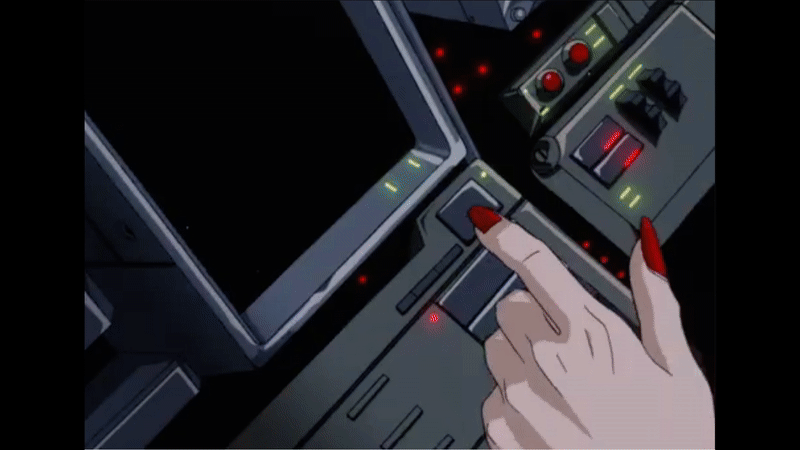

<div align="center">


<br/>


</div>

<br/>

<div align="center">

<br/>

</div>

<br/>

---

### `> SYS.BIO`

```json
{
  "target"   : "Anurag Kishan",
  "alias"    : "Ignisight",
  "role"     : "ML Intern · Student",
  "base"     : "NIT Jamshedpur, Odisha",
  "focus"    : ["Machine Learning", "Software Engineering", "Data Science"],
  "stack"    : ["Python", "TensorFlow", "Scikit-learn", "SQL"],
  "wins"     : ["🏆 RoboWar — Cognito 2023", "🏆 CANSYS — Ojas 2024"],
  "mission"  : "Build systems that push limits."
}
```

---

### `> TECH_STACK.EXE`

<div align="center">

<br/><br/>


</div>

---

### `> ACTIVE_DIRECTORIES`

| 🗂️ PROJECT | 📝 LOG | 🛠️ STACK |
|:---|:---|:---|
| [`AEGIS`](https://github.com/Ignisight/AEGIS) | Zero-trust biometric attendance network | React Native · Node.js · Python |
| [`crack_detect_sys`](https://github.com/Ignisight/Surface_crack_detection_using_CNN) | Structural defect ID via 40K+ images | Python · CNN |
| [`disease_predictor`](https://github.com/Ignisight/disease_predictor) | Multi-class agri detection @ 95%+ acc | Scikit-learn · Data Analysis |
| [`contrib_invader`](https://github.com/Ignisight/contrib_invader) | Backdated git art — arcade ship on graph | Shell · Git |

---

### `> TELEMETRY_DATA`

<div align="center">

+MONITORING_VITALS...;>+FETCHING_COMMIT_METRICS...;>+SYSTEM_OPTIMAL_+ALL_GREEN" alt="telemetry"/>

<br/>


&nbsp;


<br/><br/>


&nbsp;


<br/><br/>


</div>

---

<div align="center">

[](mailto:anuragkishan7@gmail.com)
&nbsp;
[](https://linkedin.com/in/anurag-kishan07)
&nbsp;
[](https://github.com/Ignisight)

<br/>


<sub><code>[ EOF ] :: end of system transmission // Ignisight © 2026</code></sub>

</div>
